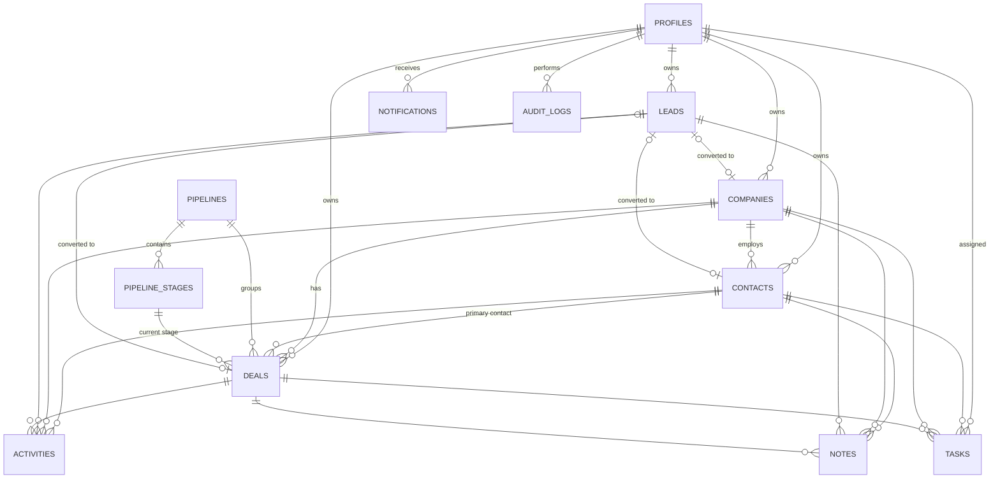

# NexaCRM — Architecture & Implementation Plan

> Status: all ten phases implemented. This document was the plan; it has been
> updated where the implementation made a different (documented) choice.

This document is the blueprint for NexaCRM. It covers the architecture, folder
structure, database schema, entity relationships, API surface, frontend pages and
the phased roadmap. Each phase is built, run, tested and verified before the next
one starts.

Guiding priority: **functionality > simplicity > clean code > polish > optimization.**

---

## 1. High-level architecture

```
┌─────────────────────────┐        ┌──────────────────────────┐
│  Next.js (TypeScript)   │  auth  │      Supabase Auth       │
│  - UI (shadcn/ui)       │◄──────►│  sign up / login / reset │
│  - Supabase JS client   │        │  email verification      │
│  - Axios + TanStack Q.  │        │  issues JWT access token │
└───────────┬─────────────┘        └────────────┬─────────────┘
            │ REST + "Authorization: Bearer <JWT>"│ JWKS (public keys)
            ▼                                     ▼
┌──────────────────────────────────────────────────────────────┐
│  FastAPI                                                     │
│  - verifies Supabase JWT (dependency)                        │
│  - loads/creates local profile + role                        │
│  - routers → services → SQLAlchemy models                    │
└───────────────────────────┬──────────────────────────────────┘
                            ▼
                ┌──────────────────────┐
                │  PostgreSQL (Docker) │  ← all CRM data, Alembic migrations
                └──────────────────────┘
```

### Request flow

1. The user signs in on the Next.js login page. The **Supabase JS client** talks
   directly to Supabase Auth and stores the session in cookies (`@supabase/ssr`).
2. `src/proxy.ts` (Next.js 16's replacement for `middleware.ts`) refreshes the
   session and redirects signed-out users to `/login`.
3. An **Axios interceptor** reads the current access token from Supabase and adds
   `Authorization: Bearer <token>` to every FastAPI request.
4. FastAPI's `get_current_user` dependency verifies the JWT signature and expiry
   (Supabase JWKS for asymmetric keys, or the legacy HS256 secret) and checks
   `aud == "authenticated"`.
5. The `sub` claim (Supabase user UUID) is looked up in our `profiles` table. On
   the user's first request a profile is created automatically ("just-in-time
   provisioning"). **If no Admin exists yet, the new user becomes Admin**
   (so seeded demo users never block it); everyone else starts as Sales
   Representative and an Admin can change roles in Settings.
6. Route handlers call **services** (business logic), which use **SQLAlchemy**
   models and write **audit logs / notifications** in the same DB transaction.

### Key decisions (and why)

| Decision | Reason |
|---|---|
| Supabase is used **only for auth**; CRM data lives in our own Postgres | Matches the spec (Postgres in Docker Compose), keeps SQLAlchemy/Alembic in full control of the schema. |
| **Synchronous** SQLAlchemy 2.0 | Easier to read, debug and explain. FastAPI runs sync endpoints in a thread pool, which is plenty for this app. |
| Enums stored as `VARCHAR`, validated by Pydantic/Python `Enum` | Avoids painful Postgres native-enum migrations when a value is added. |
| UUID primary keys everywhere | Profiles already use Supabase's UUID; consistent IDs, no guessable sequential URLs. |
| Activities / notes / tasks link to records through **nullable foreign keys** (`contact_id`, `company_id`, `lead_id`, `deal_id`) | Real FK integrity, and one call can appear on both a contact's and a deal's timeline. |
| Notes are their own table; activities are calls/meetings/emails | Notes are editable text; activities are logged interactions with a time and duration. The timeline merges both, so to the user "Note" is simply the 4th activity type. |
| Task-due notifications are generated **lazily** when notifications are fetched | No background worker needed; deterministic and easy to test. |
| Notifications refresh via TanStack Query polling (every 60s) | No websockets or extra infrastructure. |
| Kanban uses native HTML5 drag-and-drop plus a "Move to stage" menu | No extra drag-and-drop library; menu keeps it usable on touch devices. |

### Roles & authorization

Simple, table-driven rules, enforced in FastAPI dependencies/services (the UI
also hides actions a user can't perform, but the backend is the source of truth).

| Capability | Admin | Manager | Sales Rep |
|---|:-:|:-:|:-:|
| View all contacts, companies, leads, deals, tasks, activities | ✅ | ✅ | ✅ |
| Create records | ✅ | ✅ | ✅ (always owned by themselves) |
| Edit records | ✅ any | ✅ any | ✅ only records they own |
| Reassign owner | ✅ | ✅ | ❌ |
| Delete records | ✅ | ✅ | ❌ (except their own activities, notes and tasks) |
| Convert leads / move deals | ✅ | ✅ | ✅ own records |
| Sales-rep performance report | ✅ | ✅ | ❌ |
| Audit log | ✅ | ✅ | ❌ |
| Manage users & roles, pipeline stages | ✅ | ❌ | ❌ |

"Everyone sees the book of business; reps can only change their own records" is
common for small sales teams and keeps queries simple.

---

## 2. Folder structure

```
nexa-crm/
├── docker-compose.yml            # frontend + backend + postgres
├── .env.example                  # compose-level variables
├── README.md
├── docs/
│   └── ARCHITECTURE.md
├── backend/
│   ├── Dockerfile
│   ├── requirements.txt
│   ├── .env.example
│   ├── alembic.ini
│   ├── alembic/
│   │   ├── env.py
│   │   └── versions/
│   ├── app/
│   │   ├── main.py               # app factory, CORS, routers, error handlers
│   │   ├── core/
│   │   │   ├── config.py         # pydantic-settings (env vars)
│   │   │   ├── security.py       # Supabase JWT verification
│   │   │   └── exceptions.py     # NotFound / Forbidden → HTTP errors
│   │   ├── db/
│   │   │   ├── base.py           # DeclarativeBase + timestamp mixin
│   │   │   └── session.py        # engine, SessionLocal, get_db
│   │   ├── models/               # one file per table group
│   │   ├── schemas/              # Pydantic request/response models
│   │   ├── services/             # business logic (lead conversion, reports…)
│   │   ├── api/
│   │   │   ├── router.py         # includes all feature routers under /api
│   │   │   └── routes/           # companies.py, contacts.py, leads.py, ...
│   │   ├── dependencies/
│   │   │   ├── auth.py           # get_current_user, require_roles(...)
│   │   │   └── pagination.py     # page / page_size / sort params
│   │   └── utils/
│   ├── scripts/
│   │   └── seed.py               # realistic demo data
│   └── tests/
│       ├── conftest.py           # test DB + JWT factory
│       └── test_*.py
└── frontend/
    ├── Dockerfile
    ├── .env.example
    ├── components.json           # shadcn/ui config
    └── src/
        ├── proxy.ts              # session refresh + route protection
        ├── app/
        │   ├── (auth)/           # login, signup, forgot/reset password
        │   ├── (app)/            # authenticated shell (sidebar + topbar)
        │   └── auth/callback/    # Supabase email-link handler
        ├── components/
        │   ├── ui/               # shadcn/ui primitives
        │   ├── layout/           # sidebar, topbar, page header
        │   └── shared/           # data table, pagination, filters, badges,
        │                         # kanban, timeline, charts, confirm dialog
        ├── features/             # per-module components + hooks
        │   ├── contacts/         # contact-form.tsx, use-contacts.ts, ...
        │   ├── companies/  leads/  deals/  tasks/  activities/ ...
        ├── hooks/                # generic hooks (use-debounce, use-current-user)
        ├── lib/
        │   ├── supabase/         # browser + server clients
        │   ├── api-client.ts     # Axios instance + token interceptor
        │   └── query-client.ts
        ├── services/             # thin typed API functions per resource
        ├── types/                # shared TS types mirroring API schemas
        └── utils/                # formatting (currency, dates), cn()
```

---

## 3. Database schema

All tables have `id UUID PK`, `created_at` and `updated_at` (`timestamptz`,
server defaults) unless noted. `owner_id` = the "assigned user".

### profiles
Application-side user record. `id` equals the Supabase auth user id.

| Column | Type | Notes |
|---|---|---|
| id | UUID PK | = JWT `sub` |
| email | varchar, unique | |
| full_name | varchar | |
| role | varchar | `admin` \| `manager` \| `sales_rep` |
| is_active | bool | deactivated users get 403 |

### companies
| Column | Type | Notes |
|---|---|---|
| name | varchar, indexed | required |
| industry | varchar | |
| website, email, phone | varchar | |
| address, city, country | varchar/text | |
| employee_count | int | |
| owner_id | FK → profiles (SET NULL), indexed | |
| created_by_id | FK → profiles (SET NULL) | |

### contacts
| Column | Type | Notes |
|---|---|---|
| first_name, last_name | varchar | first required |
| email | varchar, indexed | |
| phone, job_title, website | varchar | |
| address, city, country | varchar/text | |
| status | varchar | `active` \| `customer` \| `inactive` |
| tags | `text[]` | filterable with `@>` |
| company_id | FK → companies (SET NULL), indexed | |
| owner_id, created_by_id | FK → profiles | |

### leads
| Column | Type | Notes |
|---|---|---|
| name, email, phone, company_name | varchar | name required |
| source | varchar | website, referral, advertisement, social_media, email, cold_call, other |
| status | varchar, indexed | new, contacted, qualified, unqualified, converted |
| score | int 0–100 | |
| owner_id, created_by_id | FK → profiles | |
| converted_at | timestamptz | |
| converted_contact_id / converted_company_id / converted_deal_id | FKs (SET NULL) | filled on conversion |

### pipelines / pipeline_stages
| pipelines | | pipeline_stages | |
|---|---|---|---|
| name | varchar | pipeline_id | FK → pipelines (CASCADE) |
| is_default | bool | name | varchar |
| | | position | int (ordering) |
| | | probability | int 0–100 (default for deals) |
| | | stage_type | `open` \| `won` \| `lost` |

Default pipeline: New → Contacted → Qualified → Proposal → Negotiation → Won → Lost.
It is created automatically on first use (`services/pipelines.get_default_pipeline`),
so a fresh database needs no manual setup.

### deals
| Column | Type | Notes |
|---|---|---|
| name | varchar | required |
| value | numeric(14,2) | |
| currency | char(3) | default `USD` |
| pipeline_id, stage_id | FKs, indexed | |
| status | varchar, indexed | `open` \| `won` \| `lost` — mirrors the stage type for simple reporting |
| probability | int 0–100 | defaults from stage |
| expected_close_date | date | |
| closed_at | timestamptz | set when moved to won/lost |
| company_id, contact_id | FKs (SET NULL) | |
| owner_id, created_by_id | FK → profiles | |
| description | text | |

### activities
| Column | Type | Notes |
|---|---|---|
| type | varchar | `call` \| `meeting` \| `email` |
| subject | varchar | |
| description | text | |
| occurred_at | timestamptz, indexed | |
| duration_minutes | int | optional |
| contact_id, company_id, lead_id, deal_id | nullable FKs (SET NULL) | at least one required (API validation) |
| owner_id | FK → profiles | who logged it |

### notes
| Column | Type | Notes |
|---|---|---|
| body | text | |
| contact_id, company_id, lead_id, deal_id | nullable FKs | at least one required |
| owner_id | FK → profiles (the author) | |

### tasks
| Column | Type | Notes |
|---|---|---|
| title | varchar | required |
| description | text | |
| due_date | date, indexed | |
| priority | varchar | low, medium, high, urgent |
| status | varchar, indexed | pending, in_progress, completed, cancelled |
| owner_id | FK → profiles, indexed | assigned user |
| contact_id, company_id, deal_id | nullable FKs | |
| completed_at | timestamptz | |
| due_notified | bool | prevents duplicate "task due" notifications |

### notifications
| Column | Type | Notes |
|---|---|---|
| user_id | FK → profiles (CASCADE) | index `(user_id, is_read)` |
| type | varchar | lead_assigned, deal_assigned, task_assigned, task_due, deal_won, deal_lost |
| title, message | varchar/text | |
| entity_type, entity_id | varchar, UUID | for linking in the UI |
| is_read | bool | |

### audit_logs
| Column | Type | Notes |
|---|---|---|
| user_id | FK → profiles (SET NULL) | |
| action | varchar | e.g. `deal.created`, `deal.stage_changed`, `lead.converted` |
| entity_type, entity_id | varchar, UUID | index on both |
| details | JSONB | e.g. `{"from": "Proposal", "to": "Won"}` |
| created_at | timestamptz, indexed | no `updated_at` (append-only) |

---

## 4. Entity relationships



### Lead conversion (single transaction)

`POST /api/leads/{id}/convert` with `{ create_deal: bool, deal_name?, deal_value?, company_id? }`:

1. Reject if the lead is already `converted` (409).
2. **Company**: use `company_id` if given; else find an existing company by
   `company_name` (case-insensitive); else create one. Skipped if the lead has no company.
3. **Contact**: create from the lead's name (split into first/last), email, phone,
   linked to the company, same owner.
4. **Deal** (optional): create in the default pipeline's first stage.
5. Re-link the lead's activities and notes to the new contact (history carries over).
6. Mark the lead `converted`, set `converted_at` and the three `converted_*_id`s.
7. Write audit log `lead.converted`; return the created IDs.

---

## 5. API endpoints

All routes are under `/api`, require a valid Supabase JWT (except `/api/health`),
and return JSON. OpenAPI docs at `/docs`.

**List conventions** (contacts, companies, leads, deals, tasks, activities, notes):
`?page=1&page_size=20&search=…&sort_by=created_at&sort_order=desc&<filters>` →
`{ items, total, page, page_size, pages }`. `sort_by` is whitelisted per resource.

**Errors**: `{ "detail": "message" }` with 400/401/403/404/409/422 as appropriate.

| Area | Method & path | Notes |
|---|---|---|
| Health | `GET /api/health` | public |
| Me | `GET /api/me`, `PATCH /api/me` | current profile & role; update name |
| Users | `GET /api/users` | list for "assign to" dropdowns |
| | `PATCH /api/users/{id}` | **admin**: role, is_active |
| Companies | `GET/POST /api/companies`, `GET/PATCH/DELETE /api/companies/{id}` | filters: industry, owner_id; detail includes contact/deal counts |
| Contacts | `GET/POST /api/contacts`, `GET/PATCH/DELETE /api/contacts/{id}` | filters: status, company_id, owner_id, tag |
| Leads | `GET/POST /api/leads`, `GET/PATCH/DELETE /api/leads/{id}` | filters: status, source, owner_id, min_score |
| | `POST /api/leads/{id}/convert` | Lead → Contact + Company + Deal |
| Pipelines | `GET /api/pipelines` | pipelines with ordered stages |
| | `POST /api/pipelines`, `PATCH /api/pipelines/stages/{id}` | **admin** |
| Deals | `GET/POST /api/deals`, `GET/PATCH/DELETE /api/deals/{id}` | filters: pipeline_id, stage_id, status, owner_id, company_id, contact_id |
| | `GET /api/deals/board?pipeline_id=` | stages with their deals (Kanban) |
| | `PATCH /api/deals/{id}/stage` | move stage → status/probability/closed_at, audit, notifications |
| Activities | `GET/POST /api/activities`, `PATCH/DELETE /api/activities/{id}` | filters: type, contact_id, company_id, lead_id, deal_id, date range |
| Notes | `GET/POST /api/notes`, `PATCH/DELETE /api/notes/{id}` | filters: contact_id, company_id, lead_id, deal_id |
| Timeline | `GET /api/timeline?contact_id=…` (or company/lead/deal) | activities + notes, newest first |
| Tasks | `GET/POST /api/tasks`, `GET/PATCH/DELETE /api/tasks/{id}` | filters: status, priority, owner_id, due_from, due_to, overdue, related ids |
| Dashboard | `GET /api/dashboard/summary` | KPI counts, deal value, recent activities, upcoming tasks, conversion rate |
| Reports | `GET /api/reports/lead-conversion` | all reports accept `start_date`, `end_date` |
| | `GET /api/reports/pipeline` | open deals count & value per stage |
| | `GET /api/reports/revenue` | won value per month |
| | `GET /api/reports/win-loss` | won vs lost counts & value per month |
| | `GET /api/reports/rep-performance` | **manager/admin** |
| | `GET /api/reports/lead-sources` | leads, conversions, rate per source |
| Notifications | `GET /api/notifications`, `GET /api/notifications/unread-count` | also generates due-task notifications lazily |
| | `PATCH /api/notifications/{id}/read`, `POST /api/notifications/read-all` | |
| Audit log | `GET /api/audit-logs` | **manager/admin**; filters: entity_type, user_id, action, date range |

### What triggers notifications / audit logs

| Event | Notification | Audit action |
|---|---|---|
| Lead created/reassigned to someone else | `lead_assigned` → new owner | `lead.created` / `lead.updated` |
| Deal created/reassigned to someone else | `deal_assigned` → new owner | `deal.created` / `deal.updated` |
| Task created/reassigned to someone else | `task_assigned` → assignee | — |
| Deal moved to Won / Lost | `deal_won` / `deal_lost` → owner + managers/admins (excluding the actor) | `deal.stage_changed` |
| Task due today or overdue | `task_due` → owner (once per task) | — |
| Lead converted | — | `lead.converted` |
| Create / update / delete of any main record | — | `<entity>.created/updated/deleted` |

---

## 6. Frontend page structure

| Route | Page | Main components |
|---|---|---|
| `/login`, `/signup` | Supabase auth forms | RHF + Zod forms |
| `/forgot-password`, `/reset-password` | Supabase password reset flow | |
| `/auth/callback` | Route handler for email-confirmation / reset links | |
| `/dashboard` | KPI cards, pipeline & lead-source charts, recent activities, upcoming tasks | StatCard, charts, ActivityTimeline |
| `/contacts` | Searchable, filterable, sortable, paginated table; create/edit dialog | DataTable, Filters, Pagination |
| `/contacts/[id]` | Details, company, deals, tasks, **activity timeline**, notes | Timeline, NotesPanel |
| `/companies`, `/companies/[id]` | Table; detail with contacts, deals, timeline | |
| `/leads`, `/leads/[id]` | Table with status/source filters; detail with **Convert lead** dialog | ConvertLeadDialog |
| `/deals`, `/deals/[id]` | List view of deals; detail with stage selector, timeline, tasks | |
| `/pipeline` | **Kanban board** — drag deals between stages; column totals | KanbanBoard |
| `/activities` | Chronological feed with type/date filters; log activity dialog | |
| `/tasks` | Table with status/priority/due filters, "My tasks" / overdue tabs | |
| `/reports` | Date-range picker + six report cards/charts | |
| `/notifications` | Full list, mark read / mark all read (bell in the topbar too) | |
| `/settings` | Profile · Users & roles (admin) · Pipeline stages (admin) · Audit log (manager/admin) | |

Create/edit forms open in dialogs/sheets instead of separate pages, which keeps
the route count low and the UX fast.

**Data layer**: `services/*.ts` (typed Axios calls) → `features/*/use-*.ts`
(TanStack Query hooks: queries with pagination/filter keys, mutations that
invalidate related queries and show toasts).

---

## 7. Implementation roadmap

Every phase ends with: run the app → run tests → fix errors → verify in the
browser → short summary of what was built.

| Phase | Scope | Verification |
|---|---|---|
| **1. Setup + Supabase auth** | Git init; backend restructure (config, DB session, Alembic, `profiles` model); JWT verification + `get_current_user` / `require_roles`; `GET /api/me`, users endpoints; Postgres via Docker Compose; frontend deps (Supabase SSR, TanStack Query, RHF, shadcn/ui); login/signup/reset pages; `proxy.ts`; app shell with sidebar; Axios interceptor | pytest auth tests (401 missing/invalid token, JIT profile, 403 role check); sign up → login → dashboard shell shows name & role |
| **2. Companies + Contacts** | Models, migrations, schemas, CRUD APIs, ownership rules; reusable DataTable, Pagination, Filters, form dialog; list + detail pages | CRUD + permission tests; manual CRUD in UI |
| **3. Leads + conversion** | Leads CRUD; conversion service & dialog | Conversion tests (creates/links company, contact, deal; 409 on re-convert) |
| **4. Deals + pipeline** | Pipelines/stages (+ default seed via migration); deals CRUD; board endpoint; stage moves; Kanban UI | Stage-move tests (status, closed_at, probability) |
| **5. Activities, tasks, notes** | Three modules + timeline endpoint + timeline component on detail pages | CRUD tests, timeline ordering |
| **6. Dashboard + reports** | Summary + 6 report endpoints; charts (shadcn charts / Recharts) | Report query tests on known data |
| **7. Notifications + audit log** | Notification + audit services wired into existing actions; bell + page; audit log in settings | Tests that actions create the right rows |
| **8. Search / filter / pagination pass** | Make every list consistent (search, filters, sorting, URL-synced state) | Query tests; UI check |
| **9. Tests, error handling, UI polish** | Global error handlers, loading/empty/error states, toasts, responsive layout, seed script | Full pytest run; `next build` + lint clean |
| **10. Docker + docs + cleanup** | Dockerfiles, full `docker-compose.yml`, `.env.example`s, README (setup, Supabase, migrations, seed, API, testing, future work) | `docker compose up` from a clean clone works end-to-end |

**Later, separate phase — "Scalability & Production Optimization"**: Redis
caching, background jobs, query optimization, rate limiting, structured logging,
monitoring, CI/CD, cloud deployment. None of it is part of the initial build.

---

## Dependencies to add

**Backend**: `psycopg[binary]` (Postgres driver), `pydantic-settings`,
`email-validator`, `PyJWT[crypto]` (JWT + JWKS verification), `pytest`, `httpx`.

**Frontend**: `@supabase/supabase-js`, `@supabase/ssr`, `@tanstack/react-query`,
`react-hook-form`, `@hookform/resolvers`, shadcn/ui (brings Radix primitives,
`class-variance-authority`, `clsx`, `tailwind-merge`), `recharts` (via shadcn charts),
`sonner` (toasts, via shadcn).

## Environment variables

| File | Variable | Purpose |
|---|---|---|
| `backend/.env` | `DATABASE_URL` | `postgresql+psycopg://…` |
| | `SUPABASE_URL` | used to fetch JWKS public keys |
| | `SUPABASE_JWT_SECRET` | optional — only for projects on legacy HS256 keys |
| | `CORS_ORIGINS` | e.g. `http://localhost:3000` |
| `frontend/.env.local` | `NEXT_PUBLIC_SUPABASE_URL` | Supabase project URL |
| | `NEXT_PUBLIC_SUPABASE_PUBLISHABLE_KEY` | publishable (anon) key — safe for the browser |
| | `NEXT_PUBLIC_API_URL` | e.g. `http://localhost:8000/api` |

No service-role key is needed anywhere, so no secret ever reaches the browser.
